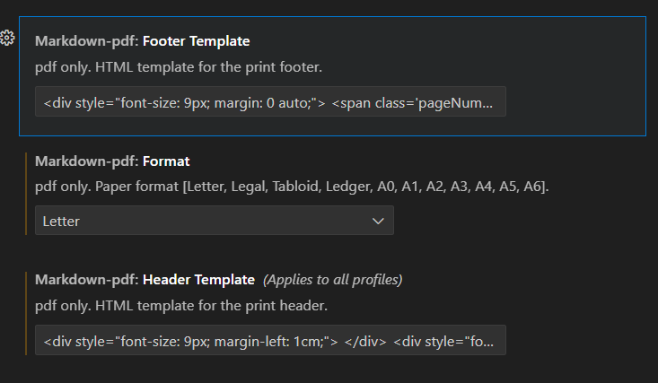

# Instructions on installing VS Code

## Sumamry

Installing VS Code

## Steps

- Download and install VS Code
- Download addons for markdown and pdf

## Download and install VS Code

- Follow these instructions for downloading VS Code
  - [Windows VS Code](https://code.visualstudio.com/docs/setup/windows)

## Download addons for markdown and pdf

- In VS Code, click on the extensions tab on the left sidebar

- Addon list
  - [Markdown PDF](https://marketplace.visualstudio.com/items?itemName=yzane.markdown-pdf)
  - [vscode-pdf](https://marketplace.visualstudio.com/items?itemName=tomoki1207.pdf)

## Modify `Markdown PDF`

- Change `Markdown PDF: Footer Template` setting
  - new setting - textbox
    ```text
    <div style="font-size: 9px; margin: 0 auto;"> <span class='pageNumber'></span> / <span class='totalPages'></span></div>
    ```

- Change `Markdown PDF: Format` setting
  - new setting - dropdown menu
    ```text
    Letter
    ```

- Change `Markdown PDF: Header Template` setting
  - new setting - textbox
    ```text
    <div style="font-size: 9px; margin-left: 1cm;"> </div> <div style="font-size: 9px; margin-left: auto; margin-right: 1cm; "></div>
    ```

- Image of settings


